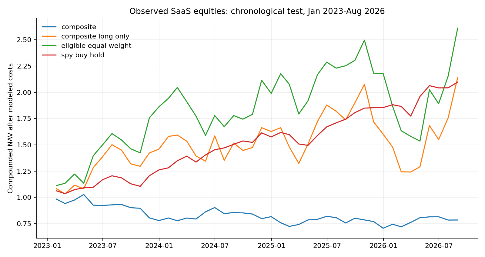
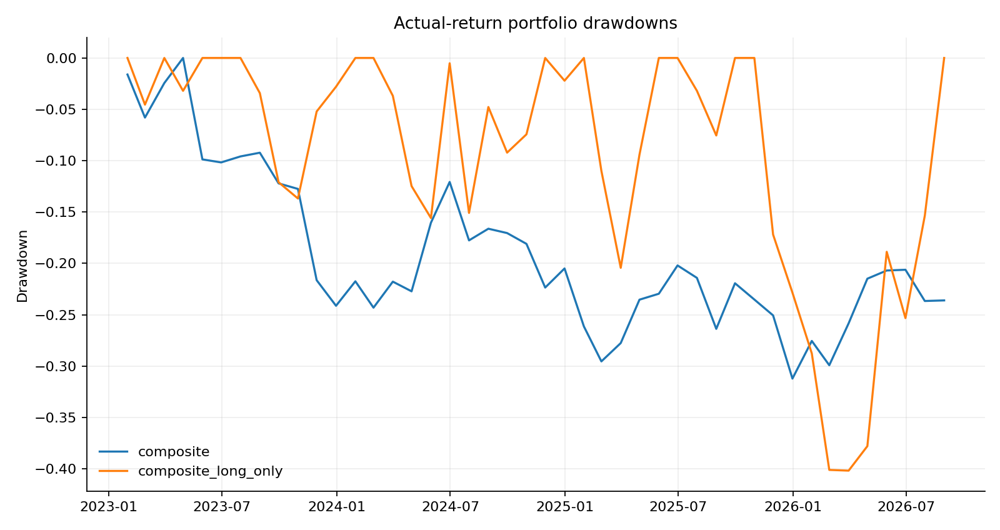

# Observed SaaS Equity Factor Research

REAL OBSERVATIONS ONLY. Retrospective research; see limitations.

## 01 / Abstract and research question

Can a fixed combination of momentum, low volatility, reported profitability and revenue growth rank subsequent returns within a small observed SaaS universe?

This run uses 1,190 eligible feature rows and 536 SEC-derived quarterly growth observations. Every input is a retrieved observation or an explicitly documented calculation from observations. No generated proxy or generated fallback is used.

The implementation runs on actual prices through August 2026. Historical valuation inputs were not constructed, so this four-signal study omits value rather than substituting invented values.

The universe consists of 12 selected surviving SaaS companies. It is not the S&P 500 and is not survivorship-bias-free. Latest-vintage price adjustments and revised hiring history prevent a claim of fully vintage-correct out-of-sample performance.

## 02 / Sample and provenance

Companies: ADBE, CRM, CRWD, DDOG, HUBS, MDB, NET, NOW, SNOW, VEEV, WDAY, ZS. Price history starts in January 2015 or at the company IPO. Stocks enter only after the required observed price history and filed fundamentals are available.

The first portfolio date with six eligible names is 2016-07-31. Development runs through December 2022; the chronological test is January 2023-August 2026.

Sources: Yahoo Finance chart endpoint for adjusted monthly prices; SEC EDGAR Company Facts for original filed accounting observations; Indeed Hiring Lab via FRED for the software-development postings index.

The normalized inputs and their hashes are included. The downloader retains original response hashes. Fundamental rows retain revenue tags, filing accession numbers, prior-year accessions and quarter-derivation flags.

## 03 / SEC quarter construction

Revenue and operating income are taken from USD facts in 10-Q/10-K filings. Direct quarterly durations must span 70-110 days. When needed, Q4 is annual cumulative revenue minus the most recently available nine-month cumulative value with the same fiscal start.

Q4 subtraction can mix filing vintages when comparative nine-month values are absent from the annual filing. Each derivation is flagged and both accessions are retained; these rows deserve manual review before stronger economic claims.

Revenue growth compares the quarter with an observed quarter ending 330-400 days earlier. Operating margin requires operating income with the same start/end and available by the revenue filing date. Missing margins remain missing.

The first reported quarter is retained. Availability is filing date plus one calendar day and joins require availability strictly before the rebalance date. This is a conservative date-level convention, not precise intraday filing reconstruction.

## 04 / Signals and portfolio design

Momentum = adjusted close at t-1 divided by adjusted close at t-12 minus one. Low volatility = negative 12-month return standard deviation through t-1. Profitability = most recently known operating margin. Growth = most recently known year-over-year quarterly revenue growth.

Signals are winsorized at cross-sectional 5th/95th percentiles and standardized within each date. Equal weights form the composite; all four values must be observed. The universe is small and tech-focused, so there is no claim of broad sector neutrality.

With at least six usable names, upper/lower terciles form +50% long/-50% short books. A separate long-only portfolio holds the upper tercile at 100%. An eligible-universe equal-weight portfolio and SPY provide comparisons.

## 05 / Backtesting framework

At each month-end, previous positions first earn observed adjusted-price returns. Cash interest and borrow are accounted for, then new targets are traded. Price-derived signals lag one full observation; the target never earns the return ending on its own row.

The engine solves fees against after-fee NAV, tracks drifting holdings and cash, and rejects missing held returns. Base commission plus slippage is 10 basis points per dollar bought or sold. Borrow is 100 basis points annually, accrued monthly. Cash earns zero.

Gross exposure is 100% for the long-short strategy, with zero net exposure. Turnover counts both purchases and sales. No terminal liquidation, realistic borrow locates, market-impact model, intramonth margin calls, taxes or delisted-company sample is included.

Sharpe/Sortino use a zero return hurdle. Benchmark beta and arithmetic alpha are diagnostics, not proof that all risk exposures were controlled. Adjusted-close changes are a vendor-adjusted approximation to total returns.

## 06 / Measured chronological test results

All table entries are calculated from the retrieved prices. Annualized returns and drawdowns are decimal fractions. No parameter or seed search was performed to make the outcome favorable.

Long-only SaaS, dollar-neutral SaaS and SPY have different risks. Compare the long-only composite with the eligible-universe benchmark as well as SPY. A realized return advantage is not automatically stock-selection alpha.

The universe consists of 12 selected surviving SaaS companies. It is not the S&P 500 and is not survivorship-bias-free. Latest-vintage price adjustments and revised hiring history prevent a claim of fully vintage-correct out-of-sample performance.

| strategy | annualized_return | sharpe | max_drawdown |
| --- | --- | --- | --- |
| composite | -0.0638 | -0.3396 | -0.3121 |
| composite_long_only | 0.2307 | 0.7408 | -0.4017 |
| eligible_equal_weight | 0.2992 | 0.8872 | -0.3847 |
| spy_buy_hold | 0.2239 | 1.6774 | -0.0833 |

## 07 / Return paths

Curves compound net returns in the test segment, carrying the strategy positions through the development/test boundary. They are historical calculations under execution assumptions, not a live track record.

Future-data perturbation tests verify that later prices and filings cannot change earlier calculated features. They cannot remove the surviving-company selection bias or the source provider revision problem.

## 08 / Risk and transaction costs

Drawdown includes the initial NAV peak. The cost-sensitivity table reruns identical targets at 0/5/10/25/50 one-way basis points, holding short borrowing at 100 basis points annually.

Inspect the exported monthly holdings, ledgers, rank ICs and signal correlation matrix. A concentrated SaaS sample can have substantial common growth and duration exposures even with zero net dollar exposure.

## 09 / Single signals and robustness

The same backtester evaluates every standalone signal. The comparison is exploratory; four signals and multiple outcomes create a multiple-testing problem. No corrected significance claim is made.

The 2023 split is a fixed chronological evaluation, but it was chosen in a contemporary retrospective project. Universe selection, specification choices and current data vintages mean it is not an untouched prospective experiment.

| strategy | annualized_return | sharpe | max_drawdown |
| --- | --- | --- | --- |
| momentum_z | 0.0289 | 0.2422 | -0.2435 |
| low_volatility_z | -0.1621 | -1.0865 | -0.5497 |
| profitability_z | -0.1562 | -0.8560 | -0.5502 |
| growth_z | 0.1006 | 0.5790 | -0.1715 |

## 10 / Conclusion, reproduction and sources

This is now a real-observation study with a smaller scope. It supports discussion of data engineering, financial definitions, implementation and the measured results. It does not establish a broad-market investment edge.

Reproduce: python -m real_research.analyze. Refresh sources: python -m real_research.download --refresh. Tests: python -m unittest discover -s tests -v.

SEC source documentation: https://www.sec.gov/search-filings/edgar-application-programming-interfaces. Yahoo endpoints and per-company source hashes are listed in data/real/manifest.json.

Potential next work: historical constituents and delistings, actual valuation denominators, source vintages, sector controls and a prospectively reserved test. None are silently substituted in this version.

