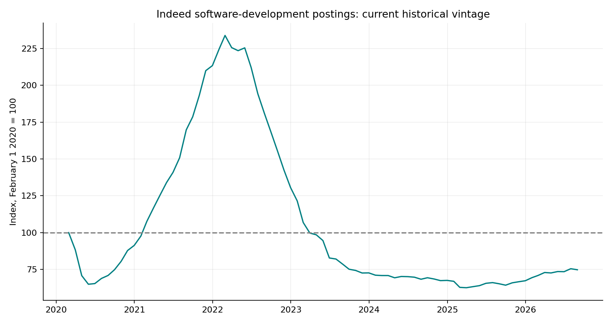

# Software Hiring and SaaS Growth

REAL OBSERVATIONS ONLY. Retrospective research; see limitations.

## 01 / Question and actual data

Does the broader software-hiring environment improve forecasts of reported SaaS revenue growth, or help explain subsequent equity returns?

The study uses 2,408 actual daily index observations from Indeed Hiring Lab, distributed by FRED as IHLIDXUSTPSOFTDEVE. The index begins February 2020 and is sampled at month-end.

This is an occupation-wide hiring index, not a history of job openings at HubSpot, Salesforce or any other individual company. The former company-specific hiring claims are not supported by this dataset.

Indeed revises historical values and changed its seasonal-adjustment methodology. The analysis is explicitly retrospective on the retrieved vintage; lagging the index does not recover what was available at a past date.

## 02 / Hiring features

Hiring growth is index(t-1) / index(t-4) - 1. Acceleration subtracts hiring growth from three months earlier. The one-month lag reduces same-month timing assumptions, but does not resolve revision bias.

A common occupational signal varies over time, not across companies. It can represent a hiring backdrop in a pooled forecasting model, but it cannot rank firms by their own hiring activity.

Missing observations are not filled with invented counts. There is no LinkedIn scraping claim, no company job-count extrapolation and no generated fallback.

## 03 / Revenue forecast comparison

The baseline ridge model uses latest reported revenue growth, operating margin, price momentum and company indicators. The augmented model adds aggregate hiring growth and acceleration. Ridge penalty is fixed at 1; scaling is estimated on training rows only.

For each monthly feature date, the target is the next observed fiscal quarter ending after that date and within 110 days. A label enters training only after its SEC reporting availability date. Repeated ticker/quarter targets are deduplicated in training.

Models expand from 2022 with at least 50 matured rows and eight target-period dates. Test begins January 2023. Scoring uses one latest forecast per company/quarter/model and only labels available by August 31, 2026.

RMSE and MAE use revenue-growth decimal units. The actual independent macro sample is much smaller than the company-row count because all companies share the hiring index.

| split | model | n | rmse | mae |
| --- | --- | --- | --- | --- |
| development | baseline | 53 | 0.1056 | 0.0867 |
| development | hiring_augmented | 53 | 0.0899 | 0.0689 |
| test | baseline | 165 | 0.1057 | 0.0811 |
| test | hiring_augmented | 165 | 0.0851 | 0.0635 |

## 04 / Equity-return tests

Return regressions compare the equal-weight available-company basket with SPY at 1-, 3- and 6-month horizons. Hiring growth and lagged SPY momentum are predictors. HAC covariance uses at least three lags and at least the return horizon.

The basket is descriptive and reweights to available real observations; it inherits selection bias. The small post-2020 macro sample, pandemic effects, revised history and overlapping returns restrict inference. Coefficients and t-statistics are exploratory.

A separate simple policy holds SPY when lagged hiring growth is positive and cash otherwise. This tests aggregate market timing, not company-specific hiring alpha. It uses the same trading-cost engine.

| strategy | annualized_return | sharpe | max_drawdown |
| --- | --- | --- | --- |
| hiring_market_timing | 0.0678 | 0.9352 | -0.0576 |
| spy_buy_hold | 0.2239 | 1.6774 | -0.0833 |

## 05 / Interpretation and limitations

A lower forecasting error would be evidence of descriptive incremental fit in this sample, not causal evidence that hiring drives revenue. A higher error would be equally reportable. Neither outcome is altered or omitted.

The narrow occupational index and SaaS company sample do not represent each employer, and may jointly respond to growth expectations, financing conditions or recession fears. Models may capture shared macro conditions rather than a new investment signal.

SEC first-report labels reduce accounting look-ahead, but current Indeed history is not an original-vintage dataset. A defensible prospective test must archive vintages or begin collecting observations before the evaluation period.

The former synthetic company hiring panel and result graphics are removed from the current repository tree. Their history is retained in Git; prior numeric claims should not be used as empirical results.

## 06 / Reproduce and audit

Run python -m real_research.analyze from either repository. Review revenue_predictions.csv, forecast_scores.csv, hiring_return_observations.csv and the 1m/3m/6m regression files. The audit includes exact normalized source hashes.

Series: https://fred.stlouisfed.org/series/IHLIDXUSTPSOFTDEVE. Attribution: Indeed, Software Development Job Postings on Indeed in the United States, retrieved via FRED, Federal Reserve Bank of St. Louis.

Methodology and CC BY 4.0 data license: https://github.com/hiring-lab/job_postings_tracker. The source explicitly documents historical revisions. Its index is not an indicator of Indeed or Recruit Holdings revenue.

Company-specific hiring research remains untested until real firm-level historical snapshots are obtained. The implemented project now answers the narrower aggregate-hiring question honestly.

